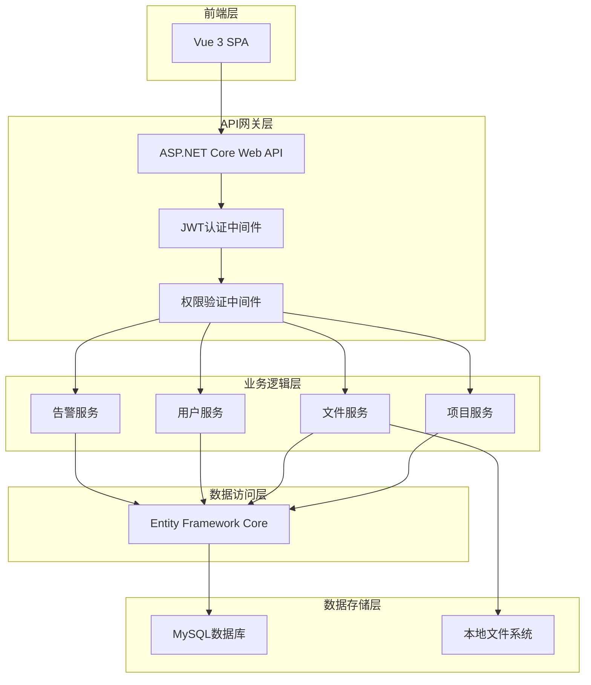
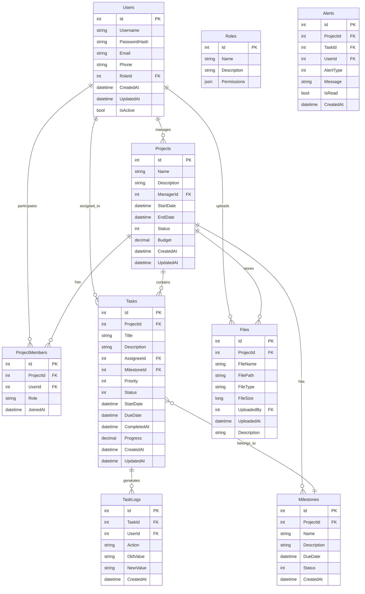
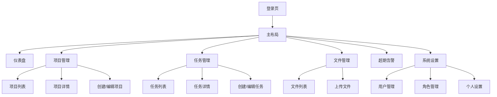
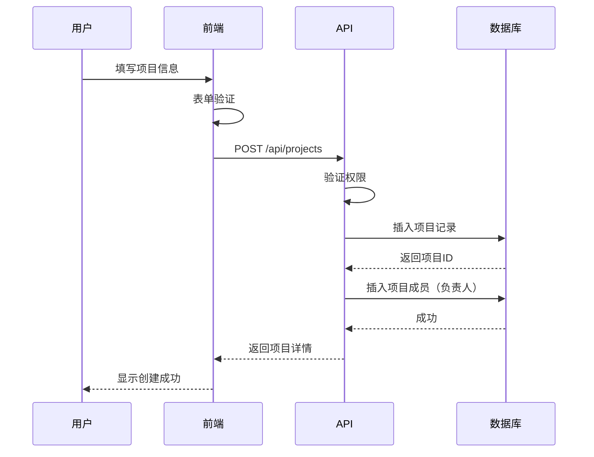
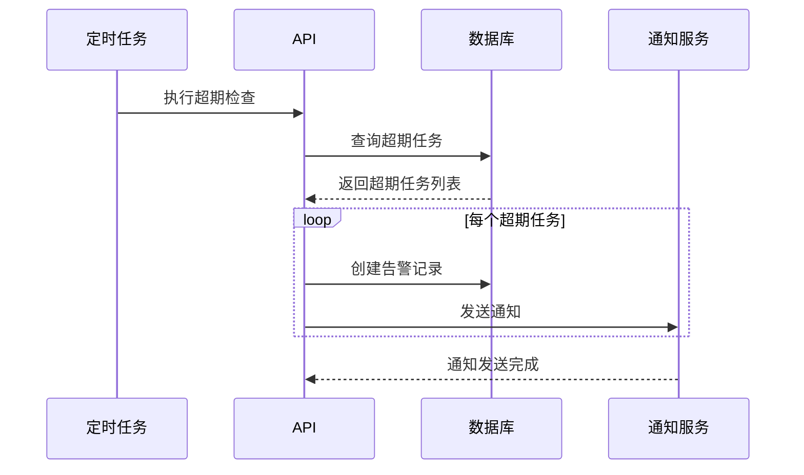
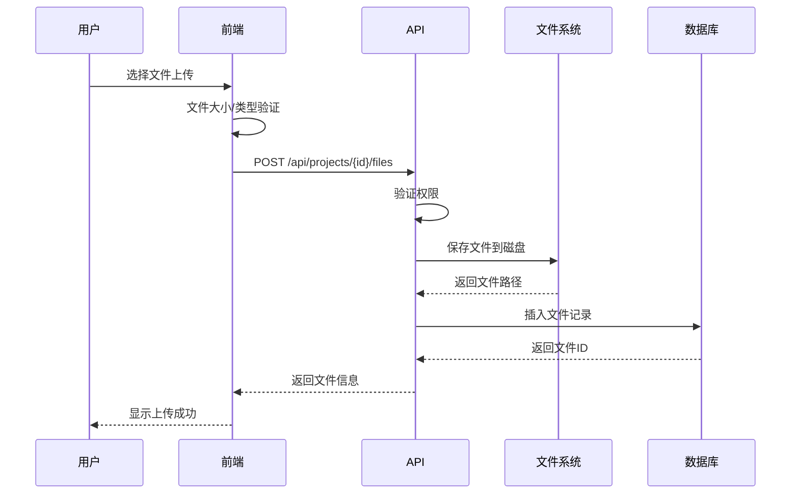

# 项目管理系统 - 详细设计文档

## 1. 项目概述

### 1.1 项目目标
构建一个功能完善的项目管理系统，支持文件存储、项目进度跟踪、责任人管理和超期告警功能。

### 1.2 技术栈
- **前端**：Vue 3 + TypeScript + Vite + Element Plus
- **后端**：ASP.NET Core 8.0 Web API
- **数据库**：MySQL 8.0
- **文件存储**：服务器本地磁盘
- **认证**：JWT Token

### 1.3 用户规模
- 预计用户数：100人左右
- 预计项目数：200个项目
- 需要角色权限管理

---

## 2. 系统架构设计

### 2.1 整体架构图



### 2.2 技术架构说明

#### 前端架构
- **框架**：Vue 3 + Composition API
- **状态管理**：Pinia
- **路由**：Vue Router 4
- **UI组件库**：Element Plus
- **HTTP客户端**：Axios
- **构建工具**：Vite

#### 后端架构
- **框架**：ASP.NET Core 8.0 Web API
- **ORM**：Entity Framework Core 8.0
- **认证**：JWT Bearer Token
- **日志**：Serilog
- **API文档**：Swagger/OpenAPI

---

## 3. 数据库设计

### 3.1 数据库ER图



### 3.2 数据库表详细设计

#### 3.2.1 Users（用户表）
```sql
CREATE TABLE Users (
    Id INT PRIMARY KEY AUTO_INCREMENT,
    Username VARCHAR(50) NOT NULL UNIQUE,
    PasswordHash VARCHAR(255) NOT NULL,
    Email VARCHAR(100) NOT NULL UNIQUE,
    Phone VARCHAR(20),
    RoleId INT NOT NULL,
    CreatedAt DATETIME DEFAULT CURRENT_TIMESTAMP,
    UpdatedAt DATETIME DEFAULT CURRENT_TIMESTAMP ON UPDATE CURRENT_TIMESTAMP,
    IsActive BOOLEAN DEFAULT TRUE,
    FOREIGN KEY (RoleId) REFERENCES Roles(Id)
);
```

#### 3.2.2 Roles（角色表）
```sql
CREATE TABLE Roles (
    Id INT PRIMARY KEY AUTO_INCREMENT,
    Name VARCHAR(50) NOT NULL UNIQUE,
    Description VARCHAR(255),
    Permissions JSON,
    CreatedAt DATETIME DEFAULT CURRENT_TIMESTAMP
);
```

#### 3.2.3 Projects（项目表）
```sql
CREATE TABLE Projects (
    Id INT PRIMARY KEY AUTO_INCREMENT,
    Name VARCHAR(100) NOT NULL,
    Description TEXT,
    ManagerId INT NOT NULL,
    StartDate DATE,
    EndDate DATE,
    Status INT DEFAULT 0, -- 0:规划中 1:进行中 2:已完成 3:已暂停
    Budget DECIMAL(15,2),
    CreatedAt DATETIME DEFAULT CURRENT_TIMESTAMP,
    UpdatedAt DATETIME DEFAULT CURRENT_TIMESTAMP ON UPDATE CURRENT_TIMESTAMP,
    FOREIGN KEY (ManagerId) REFERENCES Users(Id)
);
```

#### 3.2.4 ProjectMembers（项目成员表）
```sql
CREATE TABLE ProjectMembers (
    Id INT PRIMARY KEY AUTO_INCREMENT,
    ProjectId INT NOT NULL,
    UserId INT NOT NULL,
    Role VARCHAR(50) DEFAULT '成员', -- 负责人、成员、观察者
    JoinedAt DATETIME DEFAULT CURRENT_TIMESTAMP,
    FOREIGN KEY (ProjectId) REFERENCES Projects(Id) ON DELETE CASCADE,
    FOREIGN KEY (UserId) REFERENCES Users(Id),
    UNIQUE KEY unique_project_user (ProjectId, UserId)
);
```

#### 3.2.5 Tasks（任务表）
```sql
CREATE TABLE Tasks (
    Id INT PRIMARY KEY AUTO_INCREMENT,
    ProjectId INT NOT NULL,
    Title VARCHAR(200) NOT NULL,
    Description TEXT,
    AssigneeId INT,
    MilestoneId INT,
    Priority INT DEFAULT 1, -- 1:低 2:中 3:高 4:紧急
    Status INT DEFAULT 0, -- 0:待办 1:进行中 2:已完成 3:已取消
    StartDate DATE,
    DueDate DATE,
    CompletedAt DATETIME,
    Progress DECIMAL(5,2) DEFAULT 0,
    CreatedAt DATETIME DEFAULT CURRENT_TIMESTAMP,
    UpdatedAt DATETIME DEFAULT CURRENT_TIMESTAMP ON UPDATE CURRENT_TIMESTAMP,
    FOREIGN KEY (ProjectId) REFERENCES Projects(Id) ON DELETE CASCADE,
    FOREIGN KEY (AssigneeId) REFERENCES Users(Id),
    FOREIGN KEY (MilestoneId) REFERENCES Milestones(Id)
);
```

#### 3.2.6 Milestones（里程碑表）
```sql
CREATE TABLE Milestones (
    Id INT PRIMARY KEY AUTO_INCREMENT,
    ProjectId INT NOT NULL,
    Name VARCHAR(100) NOT NULL,
    Description TEXT,
    DueDate DATE,
    Status INT DEFAULT 0, -- 0:未开始 1:进行中 2:已完成
    CreatedAt DATETIME DEFAULT CURRENT_TIMESTAMP,
    FOREIGN KEY (ProjectId) REFERENCES Projects(Id) ON DELETE CASCADE
);
```

#### 3.2.7 Files（文件表）
```sql
CREATE TABLE Files (
    Id INT PRIMARY KEY AUTO_INCREMENT,
    ProjectId INT NOT NULL,
    FileName VARCHAR(255) NOT NULL,
    FilePath VARCHAR(500) NOT NULL,
    FileType VARCHAR(50),
    FileSize BIGINT,
    UploadedBy INT NOT NULL,
    UploadedAt DATETIME DEFAULT CURRENT_TIMESTAMP,
    Description VARCHAR(500),
    FOREIGN KEY (ProjectId) REFERENCES Projects(Id) ON DELETE CASCADE,
    FOREIGN KEY (UploadedBy) REFERENCES Users(Id)
);
```

#### 3.2.8 TaskLogs（任务日志表）
```sql
CREATE TABLE TaskLogs (
    Id INT PRIMARY KEY AUTO_INCREMENT,
    TaskId INT NOT NULL,
    UserId INT NOT NULL,
    Action VARCHAR(50) NOT NULL,
    OldValue TEXT,
    NewValue TEXT,
    CreatedAt DATETIME DEFAULT CURRENT_TIMESTAMP,
    FOREIGN KEY (TaskId) REFERENCES Tasks(Id) ON DELETE CASCADE,
    FOREIGN KEY (UserId) REFERENCES Users(Id)
);
```

#### 3.2.9 Alerts（告警表）
```sql
CREATE TABLE Alerts (
    Id INT PRIMARY KEY AUTO_INCREMENT,
    ProjectId INT,
    TaskId INT,
    UserId INT NOT NULL,
    AlertType INT NOT NULL, -- 1:任务超期 2:项目超期 3:进度滞后
    Message TEXT NOT NULL,
    IsRead BOOLEAN DEFAULT FALSE,
    CreatedAt DATETIME DEFAULT CURRENT_TIMESTAMP,
    FOREIGN KEY (ProjectId) REFERENCES Projects(Id) ON DELETE CASCADE,
    FOREIGN KEY (TaskId) REFERENCES Tasks(Id) ON DELETE CASCADE,
    FOREIGN KEY (UserId) REFERENCES Users(Id)
);
```

---

## 4. API接口设计

### 4.1 认证模块 (/api/auth)
| 方法 | 路径 | 描述 |
|------|------|------|
| POST | /api/auth/login | 用户登录 |
| POST | /api/auth/logout | 用户登出 |
| POST | /api/auth/refresh | 刷新Token |
| GET | /api/auth/current | 获取当前用户信息 |

### 4.2 用户管理模块 (/api/users)
| 方法 | 路径 | 描述 |
|------|------|------|
| GET | /api/users | 获取用户列表 |
| GET | /api/users/{id} | 获取用户详情 |
| POST | /api/users | 创建用户 |
| PUT | /api/users/{id} | 更新用户信息 |
| DELETE | /api/users/{id} | 删除用户 |
| PUT | /api/users/{id}/password | 修改密码 |

### 4.3 角色管理模块 (/api/roles)
| 方法 | 路径 | 描述 |
|------|------|------|
| GET | /api/roles | 获取角色列表 |
| GET | /api/roles/{id} | 获取角色详情 |
| POST | /api/roles | 创建角色 |
| PUT | /api/roles/{id} | 更新角色 |
| DELETE | /api/roles/{id} | 删除角色 |

### 4.4 项目管理模块 (/api/projects)
| 方法 | 路径 | 描述 |
|------|------|------|
| GET | /api/projects | 获取项目列表（分页、筛选） |
| GET | /api/projects/{id} | 获取项目详情 |
| POST | /api/projects | 创建项目 |
| PUT | /api/projects/{id} | 更新项目信息 |
| DELETE | /api/projects/{id} | 删除项目 |
| GET | /api/projects/{id}/members | 获取项目成员 |
| POST | /api/projects/{id}/members | 添加项目成员 |
| DELETE | /api/projects/{id}/members/{userId} | 移除项目成员 |

### 4.5 任务管理模块 (/api/tasks)
| 方法 | 路径 | 描述 |
|------|------|------|
| GET | /api/tasks | 获取任务列表（分页、筛选） |
| GET | /api/tasks/{id} | 获取任务详情 |
| POST | /api/tasks | 创建任务 |
| PUT | /api/tasks/{id} | 更新任务 |
| DELETE | /api/tasks/{id} | 删除任务 |
| PUT | /api/tasks/{id}/progress | 更新任务进度 |
| PUT | /api/tasks/{id}/status | 更新任务状态 |
| GET | /api/tasks/{id}/logs | 获取任务日志 |

### 4.6 里程碑模块 (/api/milestones)
| 方法 | 路径 | 描述 |
|------|------|------|
| GET | /api/projects/{projectId}/milestones | 获取项目里程碑 |
| POST | /api/projects/{projectId}/milestones | 创建里程碑 |
| PUT | /api/milestones/{id} | 更新里程碑 |
| DELETE | /api/milestones/{id} | 删除里程碑 |

### 4.7 文件管理模块 (/api/files)
| 方法 | 路径 | 描述 |
|------|------|------|
| GET | /api/projects/{projectId}/files | 获取项目文件列表 |
| POST | /api/projects/{projectId}/files | 上传文件 |
| GET | /api/files/{id}/download | 下载文件 |
| DELETE | /api/files/{id} | 删除文件 |

### 4.8 告警模块 (/api/alerts)
| 方法 | 路径 | 描述 |
|------|------|------|
| GET | /api/alerts | 获取告警列表 |
| PUT | /api/alerts/{id}/read | 标记告警已读 |
| PUT | /api/alerts/read-all | 标记所有告警已读 |
| GET | /api/alerts/unread-count | 获取未读告警数量 |

### 4.9 仪表盘模块 (/api/dashboard)
| 方法 | 路径 | 描述 |
|------|------|------|
| GET | /api/dashboard/overview | 获取概览数据 |
| GET | /api/dashboard/project-stats | 获取项目统计 |
| GET | /api/dashboard/task-stats | 获取任务统计 |
| GET | /api/dashboard/my-tasks | 获取我的任务 |

---

## 5. 前端页面设计

### 5.1 页面结构图



### 5.2 核心页面说明

#### 5.2.1 登录页
- 用户名/密码登录
- 记住密码功能
- 登录验证

#### 5.2.2 仪表盘
- 项目概览（进行中、已完成、已暂停项目数量）
- 我的任务统计（待办、进行中、已完成）
- 超期告警提醒
- 最近活动动态
- 项目进度图表

#### 5.2.3 项目列表页
- 项目列表（支持搜索、筛选、排序）
- 项目状态标签
- 项目进度条
- 快速操作（查看详情、编辑、删除）
- 创建项目按钮

#### 5.2.4 项目详情页
- 项目基本信息
- 项目成员列表
- 任务列表（按状态分组）
- 里程碑列表
- 文件列表
- 项目进度图表

#### 5.2.5 任务列表页
- 任务列表（支持多种视图：列表、看板、甘特图）
- 任务筛选（按项目、状态、责任人、优先级）
- 任务排序
- 批量操作

#### 5.2.6 任务详情页
- 任务基本信息
- 任务进度
- 责任人信息
- 任务日志
- 相关文件

#### 5.2.7 超期告警
- 告警列表
- 告警类型筛选
- 标记已读
- 告警详情

#### 5.2.8 系统设置
- 用户管理（增删改查）
- 角色管理（权限配置）
- 个人设置（修改密码、个人信息）

---

## 6. 核心功能流程

### 6.1 项目创建流程



### 6.2 任务超期告警流程



### 6.3 文件上传流程



---

## 7. 开发计划

### 7.1 开发阶段划分

#### 第一阶段：基础架构搭建（预计3-5天）
- [ ] 创建后端项目结构
- [ ] 配置数据库连接
- [ ] 实现用户认证（JWT）
- [ ] 实现基础中间件（日志、异常处理）
- [ ] 创建前端项目结构
- [ ] 配置路由和状态管理
- [ ] 实现登录页面

#### 第二阶段：核心功能开发（预计7-10天）
- [ ] 实现用户管理模块
- [ ] 实现角色权限管理
- [ ] 实现项目管理模块
- [ ] 实现任务管理模块
- [ ] 实现里程碑管理
- [ ] 实现文件上传下载

#### 第三阶段：高级功能开发（预计5-7天）
- [ ] 实现告警系统
- [ ] 实现仪表盘
- [ ] 实现任务日志
- [ ] 实现数据统计图表

#### 第四阶段：优化和完善（预计3-5天）
- [ ] 性能优化
- [ ] 安全加固
- [ ] 用户体验优化
- [ ] 测试和Bug修复
- [ ] 文档编写

### 7.2 详细任务分解

#### 后端开发任务
1. **项目初始化**
   - 创建ASP.NET Core Web API项目
   - 配置Entity Framework Core
   - 配置MySQL连接
   - 配置Swagger文档

2. **认证授权**
   - 实现JWT认证
   - 实现角色权限中间件
   - 实现登录/登出接口

3. **用户模块**
   - 用户实体和数据库配置
   - 用户CRUD接口
   - 密码加密存储

4. **项目模块**
   - 项目实体和数据库配置
   - 项目CRUD接口
   - 项目成员管理接口

5. **任务模块**
   - 任务实体和数据库配置
   - 任务CRUD接口
   - 任务状态管理
   - 任务进度更新

6. **文件模块**
   - 文件上传接口
   - 文件下载接口
   - 文件删除接口
   - 文件存储管理

7. **告警模块**
   - 告警实体和数据库配置
   - 超期检查定时任务
   - 告警查询接口

#### 前端开发任务
1. **项目初始化**
   - 创建Vue 3项目
   - 配置TypeScript
   - 配置Element Plus
   - 配置路由和Pinia

2. **基础组件**
   - 布局组件
   - 登录页面
   - 导航菜单

3. **项目管理页面**
   - 项目列表页面
   - 项目详情页面
   - 项目创建/编辑表单

4. **任务管理页面**
   - 任务列表页面（列表视图）
   - 任务列表页面（看板视图）
   - 任务详情页面
   - 任务创建/编辑表单

5. **文件管理页面**
   - 文件列表页面
   - 文件上传组件

6. **仪表盘页面**
   - 概览卡片
   - 统计图表
   - 最近活动

7. **系统设置页面**
   - 用户管理页面
   - 角色管理页面
   - 个人设置页面

---

## 8. 项目目录结构

### 8.1 后端目录结构
```
backend/
├── Controllers/           # API控制器
│   ├── AuthController.cs
│   ├── UsersController.cs
│   ├── ProjectsController.cs
│   ├── TasksController.cs
│   ├── FilesController.cs
│   └── AlertsController.cs
├── Models/               # 数据模型
│   ├── Entities/         # 实体类
│   ├── DTOs/            # 数据传输对象
│   └── ViewModels/      # 视图模型
├── Services/            # 业务逻辑服务
│   ├── Interfaces/      # 服务接口
│   └── Implementations/ # 服务实现
├── Data/                # 数据访问层
│   ├── ApplicationDbContext.cs
│   └── Repositories/    # 仓储模式
├── Middleware/          # 中间件
│   ├── ExceptionMiddleware.cs
│   └── AuthMiddleware.cs
├── Helpers/             # 辅助类
│   ├── JwtHelper.cs
│   └── FileHelper.cs
├── Configurations/      # 配置类
│   └── JwtSettings.cs
├── wwwroot/            # 静态文件
│   └── uploads/        # 上传文件存储
├── Program.cs          # 程序入口
└── appsettings.json    # 配置文件
```

### 8.2 前端目录结构
```
frontend/
├── src/
│   ├── api/            # API请求
│   │   ├── auth.ts
│   │   ├── user.ts
│   │   ├── project.ts
│   │   ├── task.ts
│   │   └── file.ts
│   ├── assets/         # 静态资源
│   ├── components/     # 公共组件
│   │   ├── layout/     # 布局组件
│   │   ├── common/     # 通用组件
│   │   └── charts/     # 图表组件
│   ├── views/          # 页面组件
│   │   ├── login/
│   │   ├── dashboard/
│   │   ├── project/
│   │   ├── task/
│   │   ├── file/
│   │   └── setting/
│   ├── router/         # 路由配置
│   │   └── index.ts
│   ├── stores/         # Pinia状态管理
│   │   ├── user.ts
│   │   ├── project.ts
│   │   └── alert.ts
│   ├── types/          # TypeScript类型定义
│   ├── utils/          # 工具函数
│   ├── App.vue
│   └── main.ts
├── public/
├── index.html
├── package.json
├── tsconfig.json
└── vite.config.ts
```

---

## 9. 安全考虑

### 9.1 认证安全
- 使用JWT Token进行身份验证
- Token设置合理的过期时间
- 实现Token刷新机制
- 密码使用BCrypt加密存储

### 9.2 授权安全
- 基于角色的访问控制（RBAC）
- API接口权限验证
- 前端路由权限控制

### 9.3 数据安全
- SQL注入防护（使用参数化查询）
- XSS防护（前端输出编码）
- CSRF防护
- 文件上传安全验证（类型、大小限制）

### 9.4 传输安全
- 使用HTTPS
- 敏感数据加密传输

---

## 10. 性能优化

### 10.1 数据库优化
- 合理创建索引
- 使用分页查询
- 避免N+1查询问题
- 使用数据库连接池

### 10.2 前端优化
- 路由懒加载
- 组件按需加载
- 图片懒加载
- 使用缓存

### 10.3 API优化
- 使用响应压缩
- 实现API缓存
- 使用异步操作

---

## 11. 测试计划

### 11.1 单元测试
- 后端服务层测试
- 前端组件测试

### 11.2 集成测试
- API接口测试
- 数据库操作测试

### 11.3 端到端测试
- 用户流程测试
- 关键功能测试

---

## 12. 部署方案

### 12.1 开发环境
- 本地开发
- 使用Docker容器化

### 12.2 生产环境
- 服务器部署
- 数据库备份策略
- 日志收集和分析
- 监控告警

---

## 13. 后续扩展

### 13.1 功能扩展
- 甘特图视图
- 项目模板
- 批量导入导出
- 消息通知（邮件、短信）
- 移动端适配

### 13.2 技术扩展
- 微服务架构
- 缓存层（Redis）
- 消息队列（RabbitMQ）
- 搜索功能（Elasticsearch）

---

## 14. 总结

本项目管理系统采用现代化的技术栈，具有良好的可扩展性和维护性。通过合理的架构设计和功能规划，可以满足100人左右团队的项目管理需求，支持200个项目的管理，实现文件存储、进度跟踪、责任人管理和超期告警等核心功能。

开发过程中需要注重代码质量、安全性和用户体验，确保系统的稳定性和可靠性。
